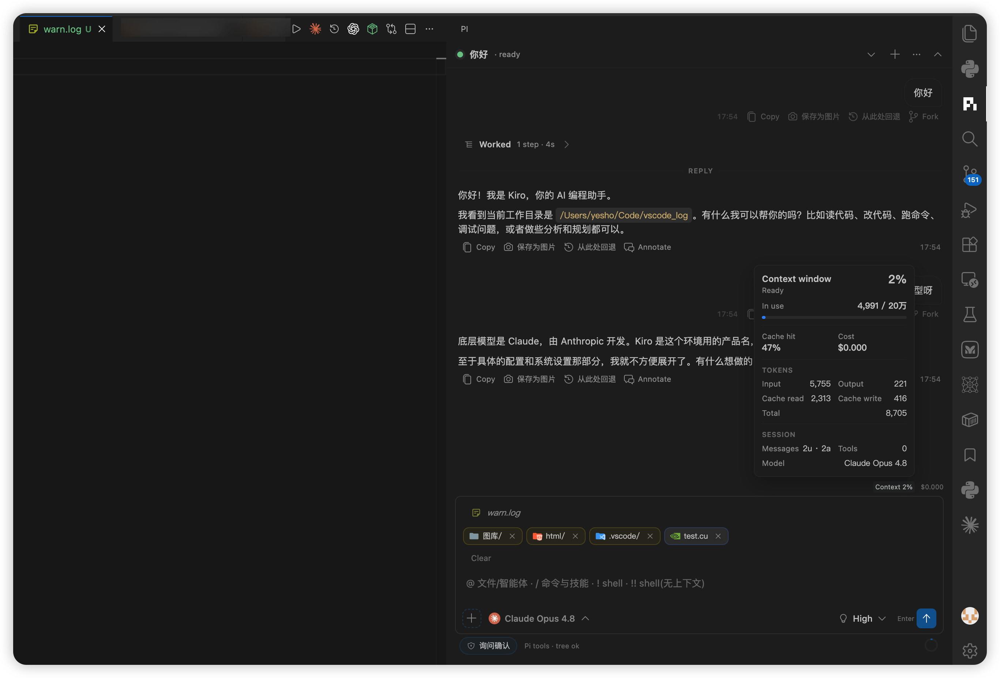
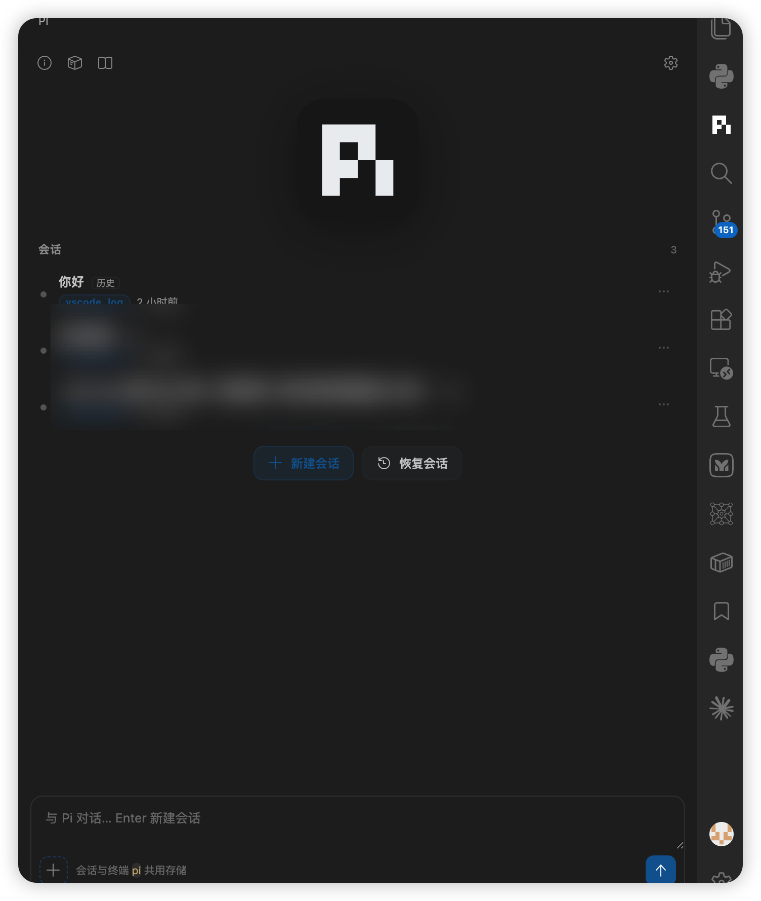

<p align="center">
  
</p>

<h1 align="center">Pi Coding Agent UI</h1>

<p align="center">
  <strong>面向 <b>Visual Studio Code</b> 的 Pi Coding Agent 扩展</strong><br>
  侧边栏、编辑器上下文、工作区会话 —— 为 VS Code 而生，不是独立聊天网页。
</p>

<p align="center">
  <a href="README.md">English</a> ·
  <a href="README.zh-CN.md">简体中文</a>
</p>

<p align="center">
  <a href="https://marketplace.visualstudio.com/items?itemName=yesho.pi-coding-agent-vscode"></a>
  
</p>

<p align="center">
  <a href="https://marketplace.visualstudio.com/items?itemName=yesho.pi-coding-agent-vscode"><b>在 VS Code Marketplace 安装</b></a>
</p>

**Pi Coding Agent UI** 是一个 **VS Code 扩展**（`yesho.pi-coding-agent-vscode`）。它把 [Pi](https://github.com/earendil-works/pi) 接到你正在用的 IDE 里：活动栏侧边栏、编辑器驱动的上下文、按工作区组织的会话，以及 VS Code 原生设置与命令。

它**不替代** Pi CLI，而是启动本机已安装的 `pi`，并复用 `~/.pi/agent`（模型、会话、技能、配置）。

<p align="center">
  
</p>
<p align="center">
  
</p>

## VS Code 适配（为什么是编辑器扩展）

| VS Code 能力 | 扩展如何用 |
|---|---|
| **活动栏** | 独立 **Pi** 入口 + 侧边栏 Webview（`piAgent.chat`） |
| **编辑器** | 打开文件 / 选区 → 上下文 chip；编辑器内 **Esc** 或 **×** 取消附着 |
| **工作区** | 会话按当前文件夹与 git worktree 作用域（与终端 `pi` 共用 `~/.pi/agent`） |
| **Quick Pick** | `+` 选文件走 VS Code 选择器；已装 **Material Icon Theme** 时显示对应图标 |
| **命令与快捷键** | 命令面板：`Pi Coding Agent: …`；Esc 关闭菜单/取消 chip |
| **设置界面** | 全部配置在 VS Code 设置中的 **`piAgent.*`** |
| **受信任工作区** | 仅在受信任文件夹激活（Pi 会访问 shell / 文件） |
| **主题** | 界面跟随 VS Code 颜色主题，而不是固定网页皮肤 |
| **编辑器面板** | 可将会话在编辑器标签中打开；诊断导出等走扩展宿主 |
| **Shell** | 输入框 `!` / `!!` 经扩展宿主终端集成执行 |

### 产品界面

- **导览首页**：大 Pi 标识、**当前文件夹**会话列表、`…` 重命名/删除、顶栏（版本 / 扩展 / 技能 / 设置）
- **会话**：模型选择、思考档位、工具卡片、Markdown/Mermaid、上下文环、权限条
- 可选：Copilot Chat 等通过 LM Provider 使用 Pi（`piAgent.*`）

## Fork 说明（务必保留）

本仓库是 **VS Code 向** 的 fork / 重命名：

| 上游 | 说明 | 许可证 |
|---|---|---|
| [frostime/pi-vscode-ui](https://github.com/frostime/pi-vscode-ui)（**FrostPi / Frost UI**） | 主要上游 **VS Code** UI | **AGPL-3.0** |
| OpenChamber | 编辑器 UI 参考 | 见上游 |
| [tintinweb/vscode-pi-model-chat-provider](https://github.com/tintinweb/vscode-pi-model-chat-provider) | Pi 标识参考（同为 VS Code 扩展） | MIT |

- 市场显示名：**Pi Coding Agent UI**；侧边栏名称：**Pi**
- 扩展 ID：`yesho.pi-coding-agent-vscode`
- 配置前缀：`piAgent.*`

本发行版保持 **AGPL-3.0**，详见 [`LICENSE`](LICENSE) 与 [`THIRD_PARTY_NOTICES.md`](THIRD_PARTY_NOTICES.md)。

## 环境要求（VS Code）

1. **VS Code 1.99+**，受信任工作区  
2. 系统 `PATH` 上有 **Pi CLI**（或 `piAgent.pi.executable`）：

   ```bash
   npm install -g @earendil-works/pi-coding-agent
   pi --version
   ```

3. 已按终端 `pi` 的方式配置好 `~/.pi` 模型

## 作为 VS Code 扩展安装

### Marketplace

1. 打开 **[Pi Coding Agent UI](https://marketplace.visualstudio.com/items?itemName=yesho.pi-coding-agent-vscode)**（或在 VS Code 扩展面板搜索）  
2. **安装**  
3. 活动栏点 **Pi**  

### 本地 VSIX

```bash
code --install-extension "artifacts/Pi Coding Agent-<version>.vsix"
# 安装后 Reload Window
```

### 源码构建

```bash
pnpm install
pnpm package:vsix
code --install-extension "artifacts/Pi Coding Agent-<version>.vsix"
```

## VS Code 设置（`piAgent.*`）

在 VS Code 设置中搜索 **Pi Coding Agent** 或 **piAgent**。

| 设置 | 默认 | 说明 |
|---|---|---|
| `piAgent.pi.executable` | `""` | `pi` 不在 PATH 时的路径 |
| `piAgent.session.autoRename` | `true` | 按首轮对话自动命名会话 |
| `piAgent.agent.permissionMode` | `ask` | `ask` / `autoConfirm` / `restricted` |
| `piAgent.composer.streamingBehavior` | `followUp` | `steer` 或 `followUp` |

## 发布 / 维护

```bash
# 发布者 yesho · 扩展 yesho.pi-coding-agent-vscode
export VSCE_PAT=<Marketplace Manage 权限的 Azure DevOps PAT>
pnpm publish:marketplace
```

也可在 Marketplace 管理页上传 VSIX。

## GitHub

[https://github.com/YeSho-cpp/pi-coding-agent](https://github.com/YeSho-cpp/pi-coding-agent)

## 许可证

AGPL-3.0，衍生作品需开源并保留对 FrostPi / Frost UI 的署名。

## 致谢

- [Pi](https://github.com/earendil-works/pi) — Mario Zechner / earendil-works  
- [FrostPi / Frost UI](https://github.com/frostime/pi-vscode-ui) — 上游 VS Code UI  
- [Material Icon Theme](https://github.com/material-extensions/vscode-material-icon-theme)（MIT）— 可选 Quick Pick 图标  
